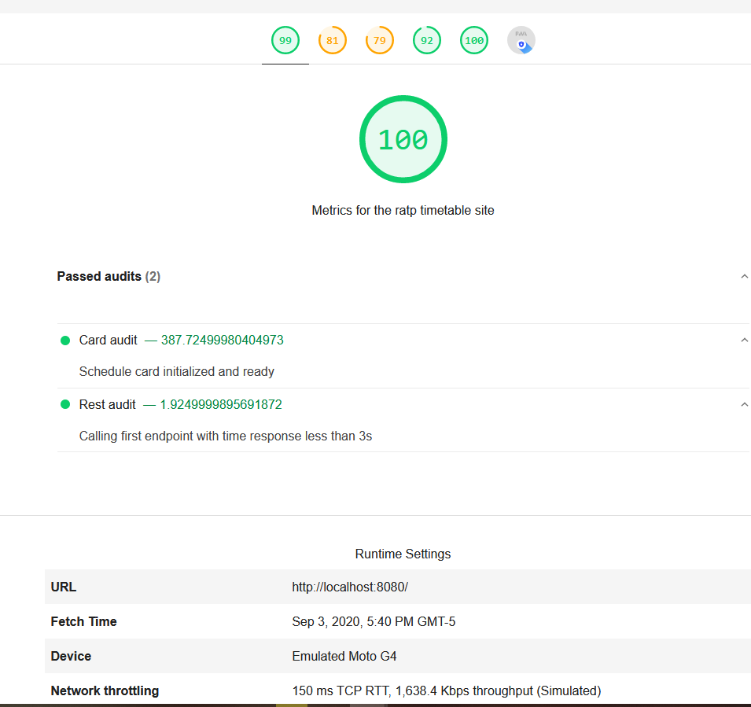

# Progressive Web App

## Como ejecutar

1. Pararse en esta carpeta, ir a la nueva carpeta e instalar las dependencias
```
npm i -g http-server
npm i -g lighthouse
```

```
cd lighthouse & npm install

```

2. Ejecutar la aplicación en un server

```
cd .. & http-server .
```

3. En otra consola ejecutar
```
lighthouse --view --config-path=custom-config.js http://localhost:8080 
```

Dele un tiempo, verá los resultados en en navegador, ademas del archivo html generado

## Lighthouse 

* Rest Audit

Se evidencia como lighthouse reporta las nuevas estadísticas



## Custom Audits

https://www.aymen-loukil.com/en/blog-en/google-lighthouse-custom-audits/
